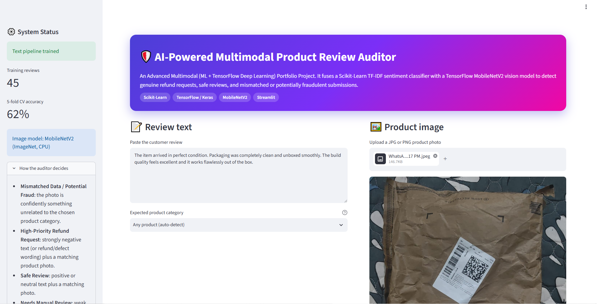
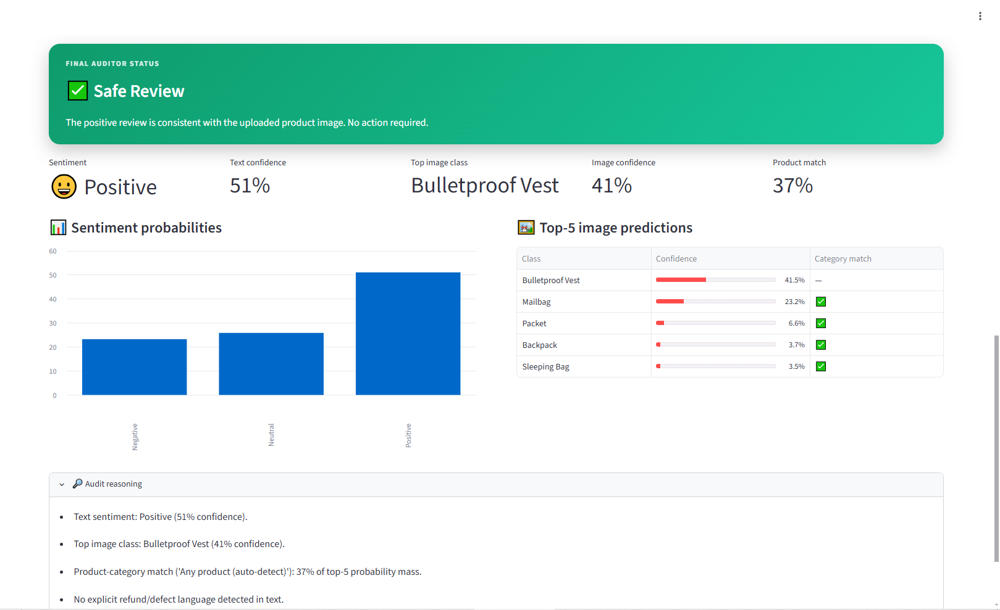

# 🎙️ AI-Powered Multimodal Product Review Auditor

An advanced corporate-grade intelligence application that combines *Traditional Machine Learning (NLP)* and *Deep Learning (Computer Vision)* into a single unified architecture. The system cross-references written customer reviews and product images simultaneously to detect e-commerce fraud, automate warranty pipelines, and prioritize customer service workflows.

---

## 🖥️ Live Dashboard Preview

### 📊 System Pipeline & Data Architecture

### 🔮 Live Multi-Modal Audit Inference

---

## 🚀 Architectural Blueprint

The application ingests two entirely disparate data streams in parallel to provide holistic multi-modal evaluations:

1. *The NLP Machine Learning Engine:* Processes raw review text through a Scikit-Learn pipeline using *TF-IDF Vectorization* paired with a *Logistic Regression* classifier to extract emotional sentiment matrices (Positive, Neutral, Negative).
2. *The Vision Deep Learning Engine:* Automatically processes user-uploaded imagery using a deep *Convolutional Neural Network (CNN)* via the pre-trained *Keras MobileNetV2* architecture (trained on ImageNet). It extracts feature maps to identify product condition tags.
3. *The Multi-Modal Intelligence Layer:* Synthesizes the predictions from both models using structural business heuristics to generate final, risk-adjusted risk tags (e.g., catching structural anomalies where the review text is positive but the image shows product components).

---

## ⚙️ Core Functionality & Risk Mapping
* *Safe / Verified Review:* High-affinity alignment between favorable customer text strings and standard intact product visual components.
* *High-Priority Refund Request:* Critical alignment between strong angry text signals and verified hardware/packaging degradation alerts.
* *Mismatched Data / Potential Fraud Flag:* Triggered when high sentiment text anomalies are submitted alongside highly incompatible visual artifacts (e.g., review text praising a laptop, but the image array registers an empty packaging container).

---

## 🛠️ Tech Stack & Keywords
* *Core Language:* Python
* *Deep Learning Framework:* TensorFlow 2.x (Keras API, MobileNetV2 Applications)
* *Machine Learning & NLP:* Scikit-Learn (TfidfVectorizer, LogisticRegression)
* *Interactive UI Interface:* Streamlit Framework
* *Image Array Processing:* Pillow (PIL), NumPy
* *Infrastructure Target:* GitHub Codespaces / Cloud Container Optimization

---

## 🚀 How to Run This Project Locally

### 1. Clone the Target Repository
bash
git clone https://github.com
cd multimodal-review-auditor

### 2. Provision Dependencies
Install the required computational frameworks using the pip package management system:
bash
pip install -r requirements.txt

### 3. Initialize the Application
Execute the interactive runtime environment command:
bash
streamlit run multimodal_app.py

---

## 📊 Model Strategy & Validation Performance
* *Dynamic Training Caching:* Text vectorization arrays and classifier coefficients are managed via Streamlit's @st.cache_resource runtime hook to eliminate model re-compilation overhead during real-time data loops.
* *Efficient Computational Footprint:* Implements tensorflow-cpu optimizations alongside structural normalization pipelines to enable fast inference speeds on standard, cost-efficient cloud container nodes.

---

## 👤 Author
* *Pranav Bavale* - [GitHub Profile](https://github.com/bavalepranav)
